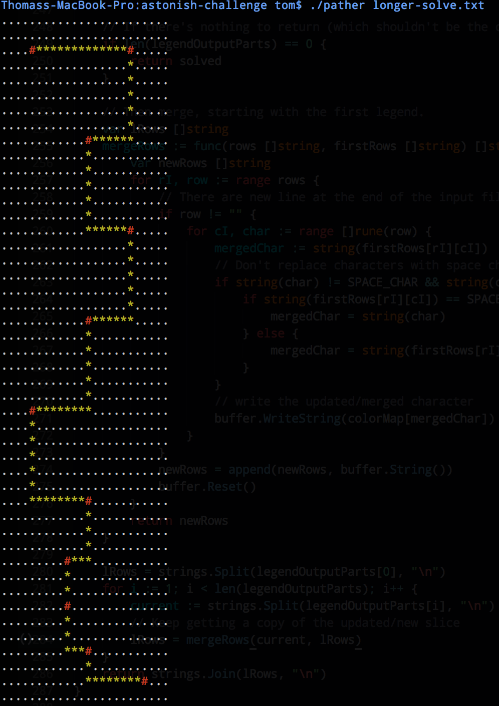

Pather
----------

A fun little multi-threaded pathfinding app.

```go get github.com/tmaiaroto/path-fun```

You should have a binary at this point in your Go binary path, but it'll be named ```path-fun``` 
You'd need one called ```pather``` to run against the tests when using ```path-problem.sh```.

So either copy and rename it so it sits next to ```path-problem.sh``` or build a new binary with:    
```go build```

Or just use the included ```pather``` binary included in the repo if you're on OS X.

To test against the challenge:    
```./path-problem```

To output to stdout in colors:    
```./pather longer-solve.txt```


